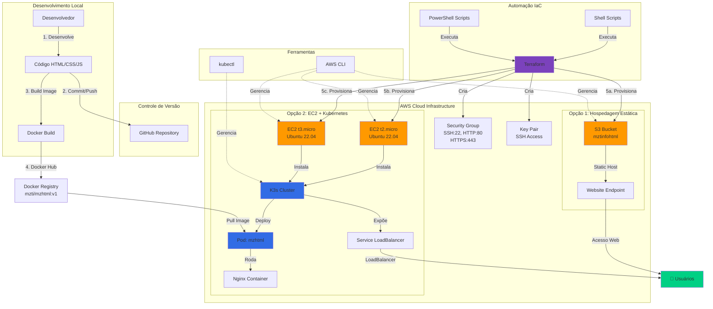
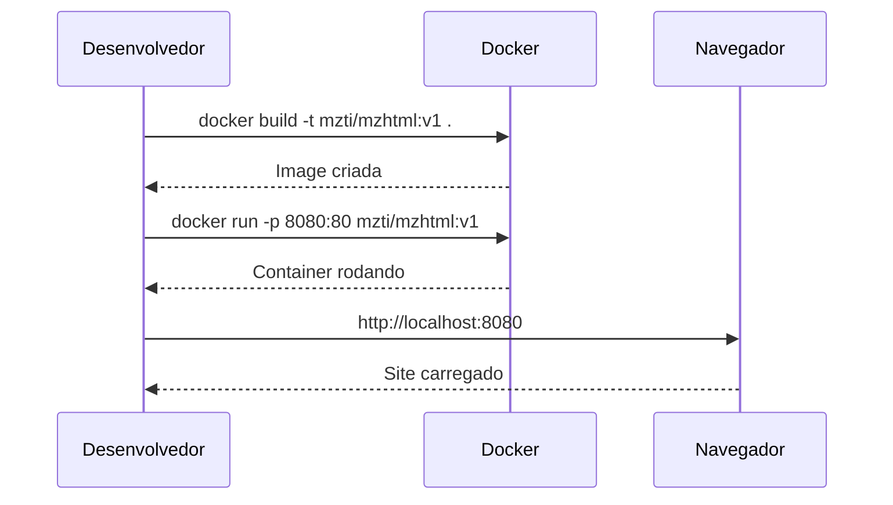
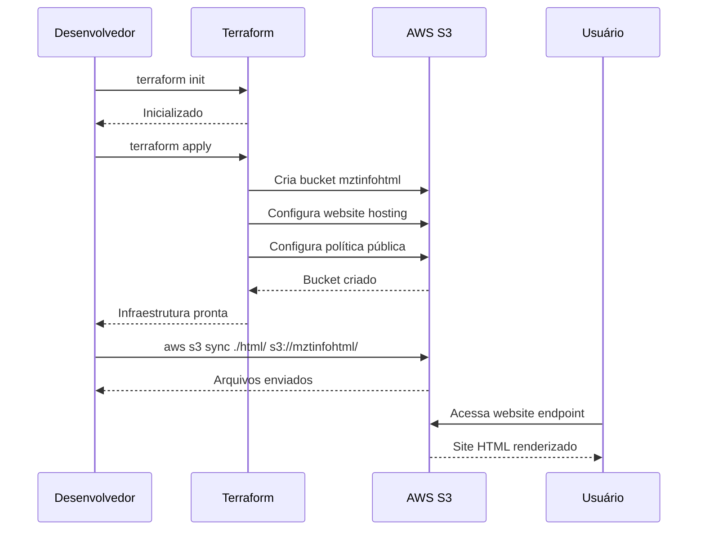
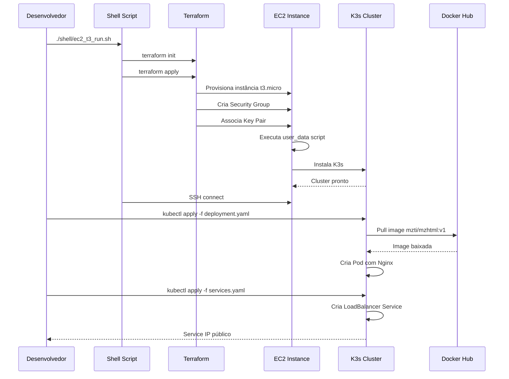
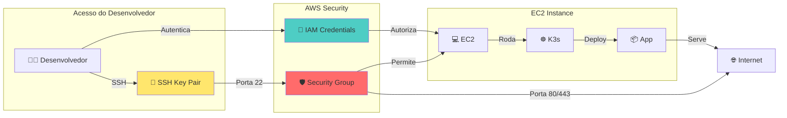

# Arquitetura Detalhada - Mozart Informática

## 📊 Diagrama de Arquitetura (Mermaid)

### Fluxo de Deploy Completo



---

## 🔄 Workflow de Deployment

### 1️⃣ Deploy Local (Desenvolvimento)



### 2️⃣ Deploy S3 (Site Estático)



### 3️⃣ Deploy EC2 + K3s (Completo)



---

## 🎯 Componentes da Arquitetura

### Frontend Layer
```
┌─────────────────────────────────────┐
│        Camada de Apresentação       │
├─────────────────────────────────────┤
│  • HTML5 (index, sobre, servicos)   │
│  • CSS3 (main.css, slick.css)       │
│  • JavaScript (jQuery, Slick)       │
│  • Imagens e Assets                 │
└─────────────────────────────────────┘
```

### Container Layer
```
┌─────────────────────────────────────┐
│      Camada de Containerização      │
├─────────────────────────────────────┤
│  • Dockerfile (nginx:alpine)        │
│  • Image: mzti/mzhtml:v1            │
│  • Porta exposta: 80                │
└─────────────────────────────────────┘
```

### Orchestration Layer
```
┌─────────────────────────────────────┐
│      Camada de Orquestração         │
├─────────────────────────────────────┤
│  • K3s (Lightweight Kubernetes)     │
│  • Deployment: 1 replica            │
│  • Service: LoadBalancer            │
│  • Auto-scaling (opcional)          │
└─────────────────────────────────────┘
```

### Infrastructure Layer
```
┌─────────────────────────────────────┐
│       Camada de Infraestrutura      │
├─────────────────────────────────────┤
│  • AWS EC2 (t2.micro / t3.micro)    │
│  • AWS S3 (Static hosting)          │
│  • Security Groups                  │
│  • Key Pairs (SSH)                  │
└─────────────────────────────────────┘
```

### Automation Layer
```
┌─────────────────────────────────────┐
│        Camada de Automação          │
├─────────────────────────────────────┤
│  • Terraform (IaC)                  │
│  • Shell Scripts (Linux)            │
│  • PowerShell (Windows)             │
│  • AWS CLI                          │
└─────────────────────────────────────┘
```

---

## 🔐 Fluxo de Segurança



---

## 📈 Escalabilidade e Alta Disponibilidade

### Cenário Atual (Single Instance)
```
┌────────────────────┐
│   Single EC2       │
│   + K3s + App      │
│   (Basic Setup)    │
└────────────────────┘
         │
         ▼
    [Usuários]
```

### Cenário Futuro (Multi-AZ com Load Balancer)
```
                ┌──────────────────┐
                │  ELB / ALB       │
                │  (Load Balancer) │
                └────────┬─────────┘
                         │
         ┌───────────────┼───────────────┐
         ▼               ▼               ▼
    ┌─────────┐    ┌─────────┐    ┌─────────┐
    │  EC2-1  │    │  EC2-2  │    │  EC2-3  │
    │  AZ-1   │    │  AZ-2   │    │  AZ-3   │
    └─────────┘    └─────────┘    └─────────┘
         │               │               │
         └───────────────┴───────────────┘
                         ▼
                   [RDS Database]
```

---

## 💰 Análise de Custos por Cenário

### Opção 1: S3 Static Website
```
┌──────────────────────────────────┐
│ Componente         │ Custo/Mês   │
├──────────────────────────────────┤
│ S3 Storage (5GB)   │ ~$0.12      │
│ S3 Requests        │ ~$0.01      │
│ Data Transfer      │ ~$0.90 (10GB)│
├──────────────────────────────────┤
│ TOTAL              │ ~$1.03/mês  │
└──────────────────────────────────┘
✅ Mais barato
✅ Menor manutenção
⚠️ Apenas conteúdo estático
```

### Opção 2: EC2 t2.micro (Free Tier)
```
┌──────────────────────────────────┐
│ Componente         │ Custo/Mês   │
├──────────────────────────────────┤
│ EC2 t2.micro       │ $0 (750h)   │
│ EBS Volume (8GB)   │ $0 (30GB)   │
│ Data Transfer      │ $0 (15GB)   │
├──────────────────────────────────┤
│ TOTAL              │ $0/mês      │
└──────────────────────────────────┘
✅ Grátis no Free Tier (12 meses)
✅ Kubernetes disponível
⚠️ Recursos limitados
```

### Opção 3: EC2 t3.micro (Free Tier)
```
┌──────────────────────────────────┐
│ Componente         │ Custo/Mês   │
├──────────────────────────────────┤
│ EC2 t3.micro       │ $0 (750h)   │
│ EBS Volume (8GB)   │ $0 (30GB)   │
│ Data Transfer      │ $0 (15GB)   │
├──────────────────────────────────┤
│ TOTAL              │ $0/mês      │
└──────────────────────────────────┘
✅ Grátis no Free Tier (12 meses)
✅ Melhor performance que t2
✅ Burstable CPU credits
```

---

## 🚀 Plano de Evolução

### Fase 1: MVP (Atual) ✅
- [x] Site HTML estático
- [x] Docker containerizado
- [x] Deploy S3
- [x] Deploy EC2 com K3s
- [x] Scripts de automação

### Fase 2: Melhorias 🔄
- [ ] CI/CD com GitHub Actions
- [ ] SSL/TLS com Let's Encrypt
- [ ] Domain personalizado
- [ ] Monitoring com CloudWatch
- [ ] Logs centralizados

### Fase 3: Escalabilidade 📈
- [ ] Auto Scaling Groups
- [ ] Application Load Balancer
- [ ] Multi-AZ deployment
- [ ] CDN com CloudFront
- [ ] RDS para dados dinâmicos

### Fase 4: Avançado 🎯
- [ ] Microservices architecture
- [ ] Service Mesh (Istio/Linkerd)
- [ ] GitOps com ArgoCD
- [ ] Infrastructure monitoring (Prometheus/Grafana)
- [ ] Disaster Recovery plan

---

## 📚 Conceitos DevOps Aplicados

### Infrastructure as Code (IaC)
```hcl
# Exemplo Terraform
resource "aws_instance" "web" {
  ami           = data.aws_ami.ubuntu.id
  instance_type = "t3.micro"
  
  tags = {
    Name = "mzti-mzhtml"
  }
}
```

### Containerização
```dockerfile
# Exemplo Dockerfile
FROM nginx:alpine
COPY html/ /usr/share/nginx/html/
EXPOSE 80
```

### Orquestração
```yaml
# Exemplo Kubernetes
apiVersion: apps/v1
kind: Deployment
metadata:
  name: mzhtml
spec:
  replicas: 1
  template:
    spec:
      containers:
      - name: mzhtml
        image: mzti/mzhtml:v1
```

---

## 🔍 Monitoramento e Observabilidade

### Métricas Sugeridas
- **CPU Usage** - Utilização da CPU
- **Memory Usage** - Uso de memória
- **Network I/O** - Tráfego de rede
- **HTTP Requests** - Requisições por segundo
- **Response Time** - Tempo de resposta
- **Error Rate** - Taxa de erros

### Logs Importantes
- **Application Logs** - Logs da aplicação
- **Nginx Access Logs** - Logs de acesso
- **Nginx Error Logs** - Logs de erro
- **K3s System Logs** - Logs do cluster
- **AWS CloudWatch** - Logs da infraestrutura

---

**Documentação criada para fins educacionais - DevOps Learning Path** 🎓
